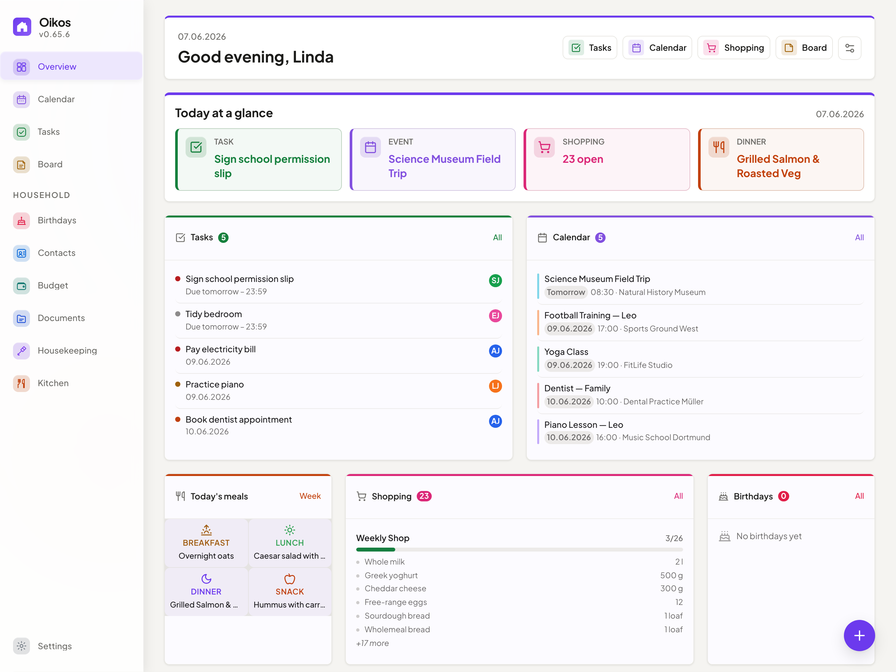
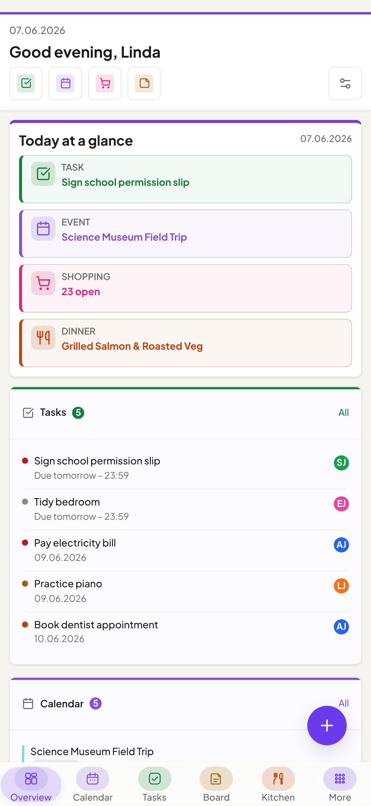
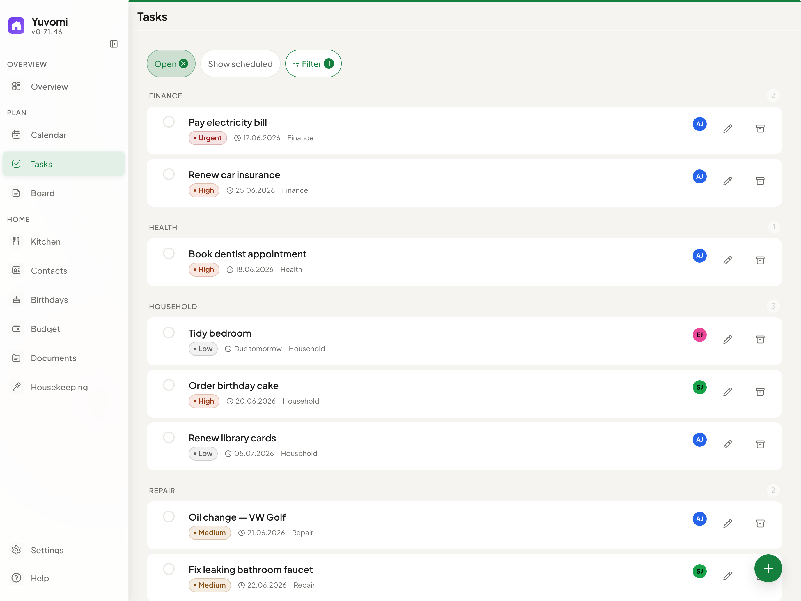
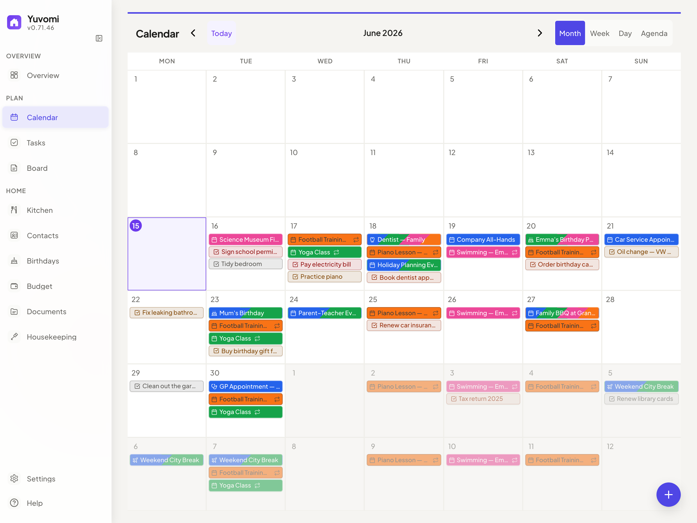
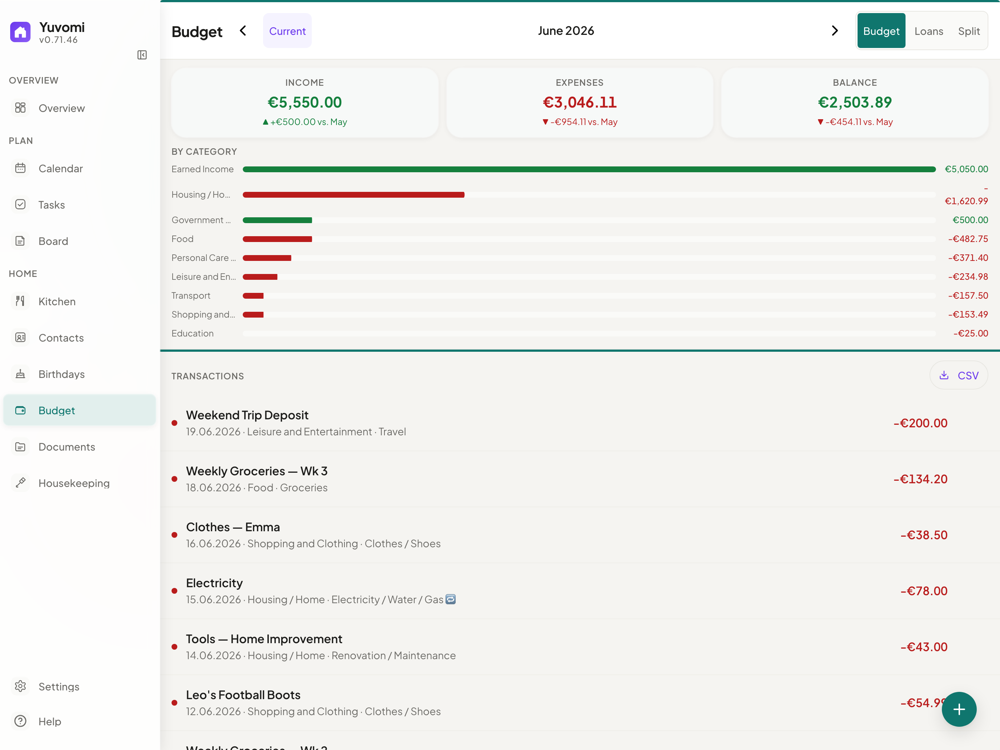
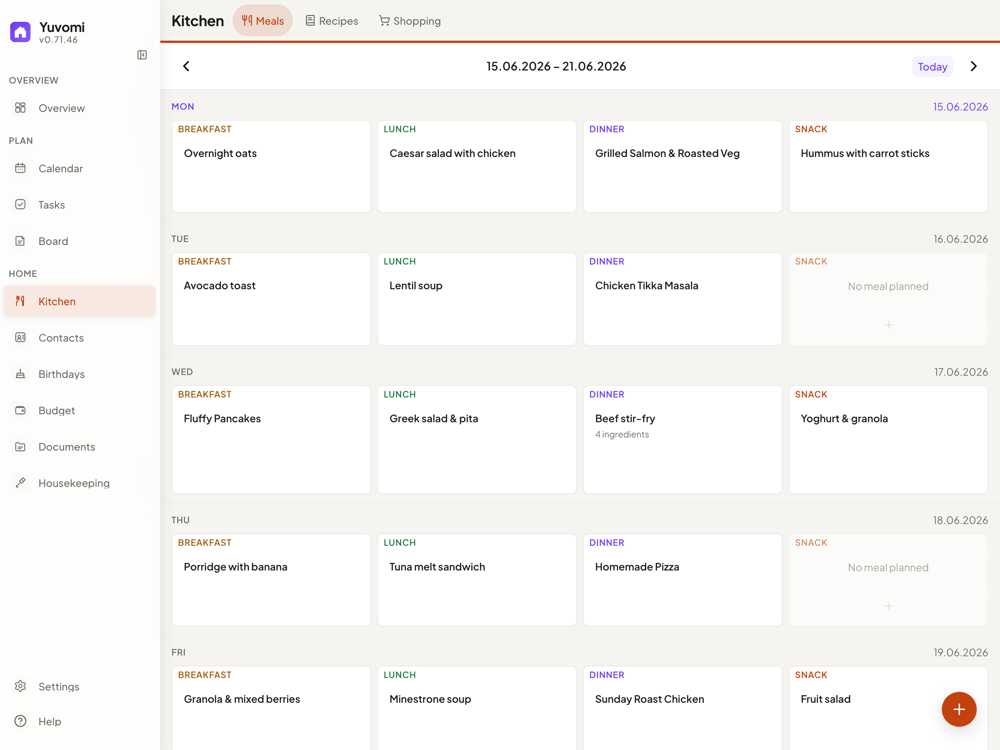
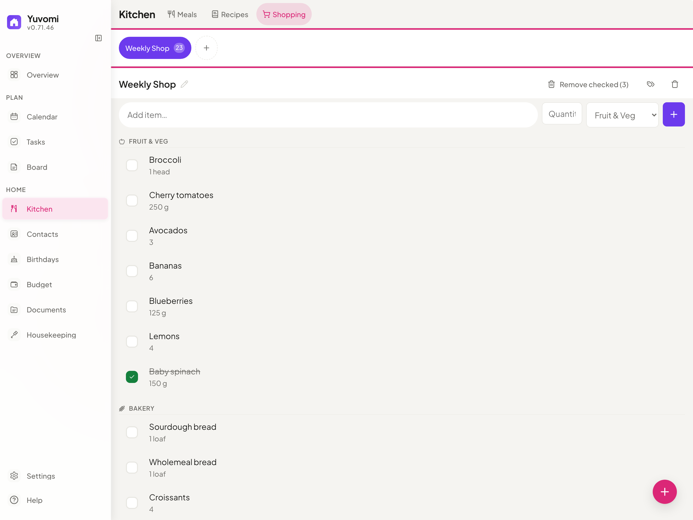
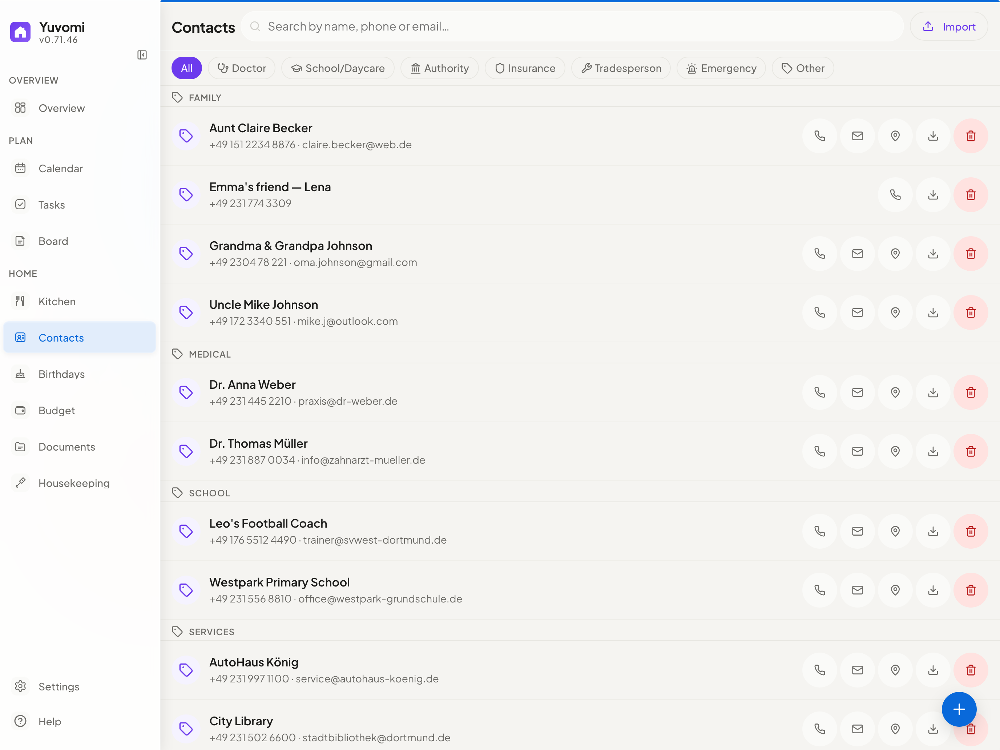

> ### 📣 Oikos is now **Yuvomi**
> This project was renamed from **Oikos** to **Yuvomi** to avoid a trademark conflict with an unrelated product of the same name. **Nothing about the app changes** — same code, same data, same maintainer.
>
> - Old links (`github.com/ulsklyc/oikos`) automatically redirect here.
> - The Docker image moved to `ghcr.io/ulsklyc/yuvomi`; the old `ghcr.io/ulsklyc/oikos` keeps working for now — please update at your convenience.
> - Your existing data and settings are fully preserved on upgrade.
>
> New home: **https://yuvomi.cloud/** · Questions? Open a [discussion](https://github.com/ulsklyc/yuvomi/discussions).

<div align="center">
  

  <h1>Yuvomi</h1>
  <p><strong>The self-hosted family planner. Private, offline-capable, and beautiful.</strong></p>

  <p>
    <a href="LICENSE"></a>
    <a href="https://github.com/ulsklyc/yuvomi/releases"></a>
    <a href="https://github.com/ulsklyc/yuvomi/pkgs/container/yuvomi"></a>
    <a href="https://nodejs.org"></a>
    
    <a href="https://github.com/ulsklyc/yuvomi/pulls"></a>
    <a href="https://apps.truenas.com/catalog/oikos_community/"></a>
    <a href="https://ca.unraid.net/apps/oikos-0s9fwat1sxc881"></a>
    <a href="https://apps.umbrel.com/app/yuvomi">
      <picture>
        <source media="(prefers-color-scheme: dark)" srcset="https://apps.umbrel.com/api/app/yuvomi/badge-dark.svg">
        <source media="(prefers-color-scheme: light)" srcset="https://apps.umbrel.com/api/app/yuvomi/badge-light.svg">
        
      </picture>
    </a>
  </p>

  <p>
    <a href="docs/installation.md"><strong>→ Install</strong></a> &nbsp;·&nbsp;
    <a href="https://yuvomi.cloud/"><strong>Website & screenshots</strong></a> &nbsp;·&nbsp;
    <a href="docs/SPEC.md"><strong>Docs</strong></a> &nbsp;·&nbsp;
    <a href="CHANGELOG.md"><strong>Changelog</strong></a>
  </p>
</div>

<br>

<div align="center">
  <table>
    <tr>
      <td align="center"><b>14</b><br><sub>modules</sub></td>
      <td align="center"><sub>·</sub></td>
      <td align="center"><b>20</b><br><sub>languages</sub></td>
      <td align="center"><sub>·</sub></td>
      <td align="center"><b>0</b><br><sub>trackers</sub></td>
      <td align="center"><sub>·</sub></td>
      <td align="center"><b>AES-256</b><br><sub>optional DB encryption</sub></td>
      <td align="center"><sub>·</sub></td>
      <td align="center"><b>MIT</b><br><sub>license</sub></td>
    </tr>
  </table>
</div>

<br>

<div align="center">
  <table>
    <tr>
      <td width="72%" align="center">
        <picture>
          <source media="(prefers-color-scheme: dark)" srcset="docs/screenshots/dashboard-dark-web.png">
          <source media="(prefers-color-scheme: light)" srcset="docs/screenshots/dashboard-light-web.png">
          
        </picture>
      </td>
      <td width="28%" align="center" valign="middle">
        <picture>
          <source media="(prefers-color-scheme: dark)" srcset="docs/screenshots/dashboard-dark-mobile.png">
          <source media="(prefers-color-scheme: light)" srcset="docs/screenshots/dashboard-light-mobile.png">
          
        </picture>
        <br>
        <sub>Mobile PWA</sub>
      </td>
    </tr>
  </table>
  <sub>Switch GitHub to dark mode to preview the dark theme &nbsp;·&nbsp; <a href="https://yuvomi.cloud/">See all screenshots →</a></sub>
</div>

<br>

Yuvomi keeps your household organized — tasks, groceries, meals, calendar, budget, and more — in one private place, without cloud accounts or subscriptions. Runs as a Docker or Podman container on any home server or NAS, including rootless Podman on SELinux-enabled RHEL/Fedora/CentOS Stream systems. A polished, mobile-first PWA makes it feel native on every device.

Each module is independent. Use what fits, skip what doesn't.

---

## App screenshots

<div align="center">
  <table>
    <tr>
      <td align="center" width="50%">
        <picture>
          <source media="(prefers-color-scheme: dark)" srcset="docs/screenshots/tasks-dark-web.png">
          <source media="(prefers-color-scheme: light)" srcset="docs/screenshots/tasks-light-web.png">
          
        </picture>
        <br><sub><b>Tasks</b> — Kanban board, recurring schedules, multi-assignment</sub>
      </td>
      <td align="center" width="50%">
        <picture>
          <source media="(prefers-color-scheme: dark)" srcset="docs/screenshots/calendar-dark-web.png">
          <source media="(prefers-color-scheme: light)" srcset="docs/screenshots/calendar-light-web.png">
          
        </picture>
        <br><sub><b>Calendar</b> — Google OAuth, iCloud, CalDAV, ICS subscriptions</sub>
      </td>
    </tr>
    <tr>
      <td align="center">
        <picture>
          <source media="(prefers-color-scheme: dark)" srcset="docs/screenshots/budget-dark-web.png">
          <source media="(prefers-color-scheme: light)" srcset="docs/screenshots/budget-light-web.png">
          
        </picture>
        <br><sub><b>Budget</b> — Income, expenses, split costs, CSV export</sub>
      </td>
      <td align="center">
        <picture>
          <source media="(prefers-color-scheme: dark)" srcset="docs/screenshots/meals-dark-web.png">
          <source media="(prefers-color-scheme: light)" srcset="docs/screenshots/meals-light-web.png">
          
        </picture>
        <br><sub><b>Meals</b> — Weekly planner, recipes, one-click shopping export</sub>
      </td>
    </tr>
    <tr>
      <td align="center">
        <picture>
          <source media="(prefers-color-scheme: dark)" srcset="docs/screenshots/shopping-dark-web.png">
          <source media="(prefers-color-scheme: light)" srcset="docs/screenshots/shopping-light-web.png">
          
        </picture>
        <br><sub><b>Shopping</b> — Shared lists, aisle groups, swipe gestures</sub>
      </td>
      <td align="center">
        <picture>
          <source media="(prefers-color-scheme: dark)" srcset="docs/screenshots/contacts-dark-web.png">
          <source media="(prefers-color-scheme: light)" srcset="docs/screenshots/contacts-light-web.png">
          
        </picture>
        <br><sub><b>Contacts</b> — Family directory, CardDAV sync</sub>
      </td>
    </tr>
  </table>
  <a href="https://yuvomi.cloud/">View all screenshots →</a>
</div>

---

## Modules

| | Module | What it does |
|:---:|---|---|
|  | **Tasks** | Shared tasks with deadlines, priorities, subtasks, recurring schedules, multi-member assignment, Kanban, and mobile bulk controls. Optional CalDAV import of Apple Reminders. |
|  | **Shopping** | Collaborative lists organized by aisle. Touch-safe quick add, swipe gestures, and meal-plan import in one tap. Optional CalDAV import. |
|  | **Meals** | Weekly drag-and-drop planner with multiple items per slot. Direct export to shopping list. |
|  | **Recipes** | Create, duplicate, and scale recipes. Pre-fill meal slots or save any planned meal as a recipe. |
|  | **Calendar** | Google Calendar (OAuth) and CalDAV sync (iCloud, Nextcloud, Radicale). ICS subscriptions, recurring events, file attachments, public & school holiday overlays (OpenHolidays), month and agenda views. Read-only `webcal://` export feed so external apps (Apple Calendar, Google Calendar, Thunderbird) can subscribe to your Yuvomi events. |
|  | **Documents** | Upload and organize family files. Folders, tags, per-document visibility controls, in-browser preview, drag-and-drop. New files, including calendar attachments, can optionally use WebDAV storage; Paperless-ngx and Papra (DMS) linking and uploads are supported. |
|  | **Budget** | Income, expenses, recurring entries, trend charts, CSV export, loans, shared expenses, and subscription tracking with renewals, budgets, currencies, alerts, and analytics. |
|  | **Housekeeping** | Manage household staff — schedules, check-in/out, daily or hourly billing, chores, supply requests. |
|  | **Notes & Contacts** | Colored sticky notes with Markdown. Contact directory with CardDAV sync. |
|  | **Birthdays** | Birthday tracker with automatic calendar events, age display, and custom reminders. |
|  | **Family** | Member profiles with roles, photos, phone, email, and birthday — synced to Contacts and Birthdays. |
|  | **Reminders** | Time-based notifications on tasks and calendar events with in-app badge counter, opt-in per-device Web Push (requires HTTPS), and admin-configured household Gotify/ntfy channels. |
|  | **API Tokens** | Named Bearer / X-API-Key tokens for integrations. OpenAPI 3.0 spec included. |
|  | **Backup** | Manual and scheduled database backup and restore, with automatic pre-restore rollback. Optional WebDAV upload target (Nextcloud, ownCloud, Hetzner, etc.). |

> **WebDAV document storage needs its own backup.** SQLite/database backups contain document metadata and links, but not document binaries stored on WebDAV. Back up the WebDAV target separately.
> WebDAV targets configured in the admin UI must resolve to public network addresses. For a trusted
> LAN or loopback target, set `DOCUMENT_STORAGE_WEBDAV_URL` through the deployment environment.

---

## Design & technology

- **Disciplined Liquid Glass UI** — readable work surfaces, subtle translucent navigation, spring animations, and module-tinted overlays — built in pure CSS, no framework
- **PWA** — installable on any device, works offline, refreshes release-bound caches reliably, and stays responsive from phone to desktop with a persistent five-destination mobile bar, configurable favorites, and tuned touch targets
- **Privacy first** — fully self-hosted, optional SQLCipher AES-256 database encryption (enabled in the recommended Docker setup), zero telemetry
- **SSO / OpenID Connect** — optional single sign-on via any OIDC provider (Authentik, Keycloak, Google, Microsoft Entra) configured with four env vars; Authorization Code + PKCE flow
- **Self-service password reset** — optional SMTP email lets users reset a forgotten password themselves via a time-limited emailed link; anti-enumeration by design
- **Zero build step** — pure ES modules, no bundler, no transpiler, no framework
- **Multilingual** — 20 languages with automatic locale detection (de, en, es, fr, it, sv, el, ru, tr, zh, ja, ar, hi, pt, uk, pl, nl, cs, vi, hu)

---

## Install anywhere

### Web installer (recommended)

A localized setup wizard — 20 languages — that runs in your browser. Auto-detects Docker or Podman, configures HTTPS, SSO, and scheduled backups, then starts the container and creates your admin account.

```bash
git clone https://github.com/ulsklyc/yuvomi.git && cd yuvomi
node tools/installer/install-server.js
```

Open **http://localhost:8090**. Requires Node.js 18+ on the host.

### Docker / Podman

**Pre-built image:**

```bash
curl -O https://raw.githubusercontent.com/ulsklyc/yuvomi/main/docker-compose.yml
curl -O https://raw.githubusercontent.com/ulsklyc/yuvomi/main/.env.example
cp .env.example .env          # set SESSION_SECRET and DB_ENCRYPTION_KEY
docker compose up -d
```

**Build from source:**

```bash
git clone https://github.com/ulsklyc/yuvomi.git && cd yuvomi
cp .env.example .env
docker compose up -d --build
```

Open `http://localhost:3000`. The first visit walks you through creating your admin account.

> **Podman (RHEL / Fedora / CentOS Stream):** Both installers auto-detect Podman and use `podman-compose.yml` with SELinux `:Z` labels. For a manual start: `podman compose -f podman-compose.yml up -d`. Rootless systemd autostart: `tools/quadlet/oikos.container`.

### NAS & home servers

<table>
  <tr>
    <td><b>TrueNAS SCALE</b></td>
    <td>Apps → Discover Apps → search <b>Yuvomi</b> → Install</td>
    <td>No terminal required. Community Apps Catalog. Version updates via Renovate.</td>
  </tr>
  <tr>
    <td><b>Umbrel</b></td>
    <td>App Store → search <b>Yuvomi</b> → Install</td>
    <td>One-click install. Everything stays on your Umbrel.</td>
  </tr>
  <tr>
    <td><b>Unraid</b></td>
    <td>Apps → search <b>Yuvomi</b> → Apply</td>
    <td>Community Applications template. Set <code>SESSION_SECRET</code> during install.</td>
  </tr>
</table>

> **New to Docker or Podman?** The **[Installation Guide](docs/installation.md)** covers engine setup, HTTPS/reverse proxy, backups, and troubleshooting step by step.

---

## Tech stack

<p>
  
  
  
  
  
  
  
</p>

---

## Documentation

[Installation](docs/installation.md) &nbsp;·&nbsp; [Spec & data model](docs/SPEC.md) &nbsp;·&nbsp; [Modules](MODULES.md) &nbsp;·&nbsp; [Contributing](CONTRIBUTING.md) &nbsp;·&nbsp; [Security](SECURITY.md) &nbsp;·&nbsp; [Privacy for self-hosters](docs/PRIVACY-FOR-SELFHOSTERS.md) &nbsp;·&nbsp; [Changelog](CHANGELOG.md) &nbsp;·&nbsp; [Backlog](BACKLOG.md)

If you self-host Yuvomi in a GDPR context (EU/EEA, processing other people's data), read [docs/PRIVACY-FOR-SELFHOSTERS.md](docs/PRIVACY-FOR-SELFHOSTERS.md) before going live: it covers third-country assessments for every external service (weather, CalDAV/CardDAV, OIDC, WebDAV backup and document storage), data-processing-agreement notes, log-retention guidance, and a records-of-processing template.

---

## License

MIT — see [LICENSE](LICENSE).

<div align="center">
  <br>
  <sub>Built with care for families who value privacy and simplicity.</sub>
</div>
