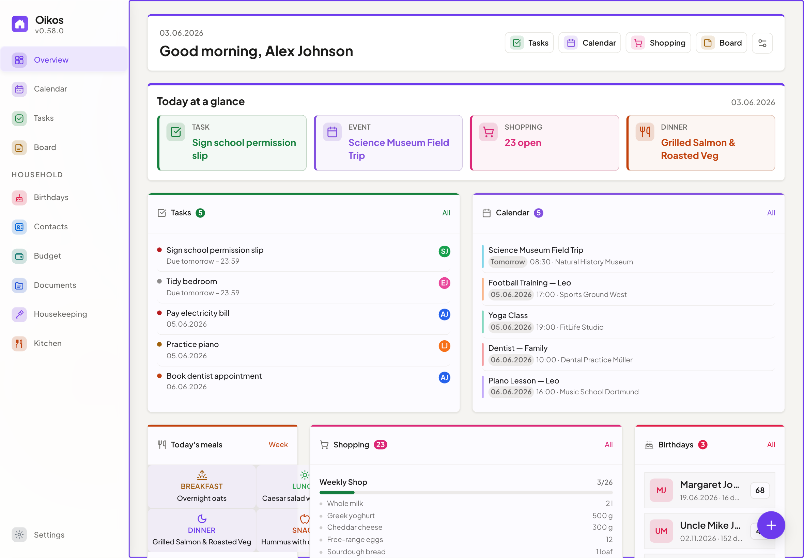

<div align="center">
  

  <h1>Oikos</h1>
  <p><strong>The self-hosted family planner. Private, offline-capable, and beautiful.</strong></p>

  <a href="LICENSE"></a>
  <a href="https://github.com/ulsklyc/oikos/releases"></a>
  <a href="https://github.com/ulsklyc/oikos/pkgs/container/oikos"></a>
  <a href="https://nodejs.org"></a>
  <a href="https://github.com/ulsklyc/oikos/pulls"></a>

  <p>
    <a href="docs/installation.md"><strong>→ Install</strong></a> &nbsp;·&nbsp;
    <a href="https://ulsklyc.github.io/oikos/"><strong>Screenshots</strong></a> &nbsp;·&nbsp;
    <a href="docs/SPEC.md"><strong>Docs</strong></a>
  </p>
</div>

<br>

<div align="center">
  <picture>
    <source media="(prefers-color-scheme: dark)" srcset="docs/screenshots/dashboard-dark-desktop.png">
    <source media="(prefers-color-scheme: light)" srcset="docs/screenshots/dashboard-light-desktop.png">
    
  </picture>
  <br>
  <sub>Toggle GitHub light/dark mode to see both themes &nbsp;·&nbsp; <a href="https://ulsklyc.github.io/oikos/">View all screenshots</a></sub>
</div>

<br>

Oikos is a self-hosted web app that keeps your household organized — tasks, groceries, meals, calendar, budget, and more — in one private place, without cloud accounts or subscriptions. Runs as a Docker container on any home server or NAS. Accessible on every device. Installable as a PWA.

Each module is independent. Use what fits, skip what doesn't.

## Features

| Module | Description |
|---|---|
| **Tasks** | Shared tasks with deadlines, priorities, subtasks, and recurring schedules. Assign to multiple family members simultaneously with stacked avatar display. Kanban board with touch-friendly one-tap status buttons. Archive completed tasks to keep lists clean. Inline reminder presets (15 min to 2 weeks before due). Schedule tasks with a future start date — future tasks are hidden by default and revealed via a "Show scheduled" toggle. |
| **Shopping Lists** | Collaborative lists organized by aisle. Import ingredients from meal plans in one click. |
| **Meal Planning** | Weekly drag-and-drop planner. Export ingredient lists directly to your shopping list. |
| **Recipes** | Create, duplicate, and scale reusable recipes. Pre-fill meal slots from a recipe or save any meal as a recipe. |
| **Calendar** | Two-way sync with Google Calendar (OAuth) and multiple CalDAV accounts (iCloud, Nextcloud, Radicale, Baikal). Per-account calendar selection with checkboxes. Subscribe to any public ICS/webcal URL with per-subscription color and visibility. Recurring events support daily, weekly, monthly, and yearly frequencies. Overlapping timed events render side-by-side. Events support file attachments (images, PDFs, Office documents). Tasks with a due date appear as priority-coloured chips in all calendar views — click to open the task. |
| **Documents** | Upload and manage family files (PDF, images, Office documents up to 5 MB). Organize into custom folders with a sidebar browser. Grid/list view, drag-and-drop upload, 14 category tags (medical, school, identity, finance, and more), per-document visibility (family, selected members, private), archive and download. |
| **Budget** | Track income and expenses with recurring entries, monthly trends, and CSV export. 35 predefined categories plus custom ones. Supports 15 currencies. Loans tab for instalment-based loan tracking. **Split Expenses** tab for shared costs within groups — equal, percentage, exact-amount, and shares split methods, multi-currency support, immutable ledger, automatic debt simplification, and recurring expenses. |
| **Housekeeping** | Manage household staff workflows. Staff profiles with daily rate, calendar color, and payment schedule. Work session check-in/check-out with automatic calendar event creation and optional payment task. Recurring chore tracking with urgency decay indicators. Supply requests linked to shopping lists. Monthly visit log with payment summaries. |
| **Notes & Contacts** | Colored sticky notes with Markdown support. Contact directory with multi-account CardDAV sync (Nextcloud, iCloud, Radicale, Baikal), multiple phones/emails/addresses per contact, and vCard import/export. |
| **Birthdays** | Birthday tracker with automatic annual calendar events, age display, profile photos, and customizable reminder offsets (preset or fully custom interval). |
| **Reminders** | Time-based reminders on tasks and calendar events. In-app notification badge. |
| **Family** | Assign family roles, profile pictures, phone, email, and birthday per member. Family details are automatically synced to Contacts and Birthdays. |
| **API Tokens** | Named Bearer / X-API-Key tokens for external integrations. SHA-256-hashed at rest, with optional expiry. OpenAPI 3.0 spec at `/api/v1/openapi.json`. |
| **Backup** | Admin-only database backup and restore via the Settings UI. Download a snapshot or restore from a file upload with an automatic pre-restore rollback copy. Automatic scheduled backups (configurable schedule, rotation, retention). |

## Design & Technology

- **Liquid Glass UI** — translucent surfaces, backdrop blur, module-tinted overlays, spring animations — inspired by Apple's Liquid Glass, built in pure CSS
- **PWA** — installable on any device, works offline, dark mode, responsive from phone to desktop
- **Privacy First** — SQLCipher AES-256 encrypted database, fully self-hosted, zero telemetry
- **Zero Build Step** — pure ES modules, no bundler, no transpiler, no framework
- **Multilingual** — 16 languages with automatic locale detection (de, en, es, fr, it, sv, el, ru, tr, zh, ja, ar, hi, pt, uk, pl)

## Quick Start

**Option A — Web Installer (recommended)**

```bash
git clone https://github.com/ulsklyc/oikos.git && cd oikos
node tools/installer/install-server.js
```

Open **http://localhost:8090** in your browser. The wizard configures your `.env`, starts Docker, and creates your admin account. Requires Node.js 18+ on the host.

**Option B — Pre-built image (no clone required)**

```bash
curl -O https://raw.githubusercontent.com/ulsklyc/oikos/main/docker-compose.yml
curl -O https://raw.githubusercontent.com/ulsklyc/oikos/main/.env.example
cp .env.example .env          # set SESSION_SECRET and DB_ENCRYPTION_KEY
docker compose up -d
docker compose exec oikos node setup.js
```

**Option C — Build from source**

```bash
git clone https://github.com/ulsklyc/oikos.git && cd oikos
cp .env.example .env          # set SESSION_SECRET and DB_ENCRYPTION_KEY
docker compose up -d --build
docker compose exec oikos node setup.js
```

Open `http://localhost:3000` and sign in with the admin credentials you created above.

> **New to Docker?** The **[Installation Guide](docs/installation.md)** covers Docker setup, HTTPS, backups, and troubleshooting step by step.

## Tech Stack

<p>
  
  
  
  
  
  
</p>

## Documentation

| [Installation](docs/installation.md) | [Spec & Data Model](docs/SPEC.md) | [Modules](MODULES.md) | [Contributing](CONTRIBUTING.md) | [Security](SECURITY.md) | [Changelog](CHANGELOG.md) | [Backlog](BACKLOG.md) |
|---|---|---|---|---|---|---|

## License

<a href="LICENSE"></a>

<div align="center">
  <sub>Built with care for families who value privacy and simplicity.</sub>
</div>
