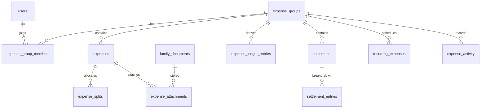

# Split Expenses Architecture

Split Expenses is a native Oikos module. It uses the existing Express API, session authentication, CSRF middleware, `better-sqlite3` database layer, vanilla SPA router, local design tokens, and locale files.

## Data Model



## Ledger Rules

Balances are never stored directly. They are derived from immutable rows in `expense_ledger_entries`.

- Expenses credit the payer for the converted amount.
- Expense splits debit each participant for their allocated share.
- Settlements credit the paying user and debit the receiving user.
- Deleted or edited expenses remove and recreate only the source ledger rows for that source.
- All amounts are stored as integer minor units, such as cents, to avoid floating point loss.

Debt simplification groups balances by currency, sorts debtors and creditors deterministically by user id, and emits the minimum payment chain needed to settle the group.

## Currency

Every expense stores:

- original `amount_minor` and `currency`
- converted `converted_amount_minor` and `converted_currency`
- exchange-rate numerator/denominator fields for future precise exchange workflows
- `exchange_snapshot` JSON for locked historical exchange metadata

The default currency comes from Settings > Budget through `sync_config.currency`.

## Security

All endpoints live under `/api/v1/split-expenses`, behind the existing authenticated and CSRF-protected API chain. Group membership is checked before reading group expenses, balances, settlements, recurring expenses, and activity. Group owners/admins can edit group membership; members can add expenses and settlements to groups they belong to.

Receipt and proof uploads are designed to integrate through existing `family_documents`; `expense_attachments` links documents to expenses without introducing a new storage mechanism.

## API Surface

- `GET /api/v1/split-expenses/meta`
- `GET /api/v1/split-expenses/dashboard`
- `GET|POST /api/v1/split-expenses/groups`
- `PATCH /api/v1/split-expenses/groups/:id`
- `POST /api/v1/split-expenses/groups/:id/archive`
- `GET|POST /api/v1/split-expenses/groups/:id/members`
- `GET|POST /api/v1/split-expenses/groups/:id/expenses`
- `PUT|DELETE /api/v1/split-expenses/expenses/:id`
- `POST /api/v1/split-expenses/expenses/:id/comments`
- `GET /api/v1/split-expenses/groups/:id/balances`
- `POST /api/v1/split-expenses/groups/:id/settlements`
- `GET /api/v1/split-expenses/groups/:id/activity`
- `GET|POST /api/v1/split-expenses/groups/:id/recurring`
- `POST /api/v1/split-expenses/recurring/:id/pause`
- `GET /api/v1/split-expenses/search`

## Developer Notes

Run the focused test suite with:

```bash
npm run test:split-expenses
```

The SPA surface is embedded in Budget as the `Split` tab, implemented in `public/pages/split-expenses.js` with styles in `public/styles/split-expenses.css`.

Recurring expenses are generated by `server/services/split-expenses-scheduler.js`, which runs hourly in-process with the existing Oikos server and advances `next_run_date` after each generated occurrence.
